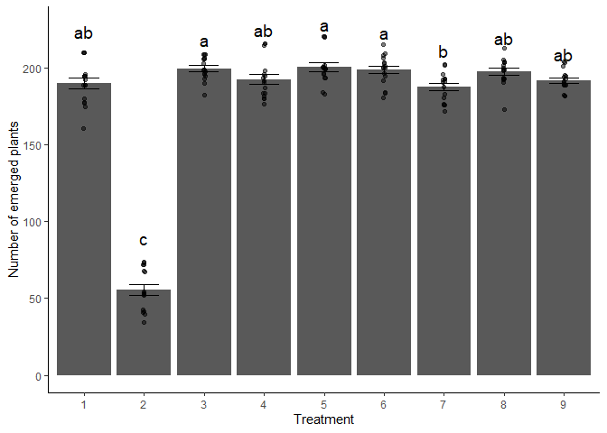

Loading in libraries and setting working directory

``` r
setwd("C:/Users/Dutal/OneDrive/Desktop/Classes/PLPA 6820/Linear Models/Coding-Challenge-7")
library(tidyverse)
```

    ## ── Attaching core tidyverse packages ──────────────────────── tidyverse 2.0.0 ──
    ## ✔ dplyr     1.1.4     ✔ readr     2.1.5
    ## ✔ forcats   1.0.0     ✔ stringr   1.5.1
    ## ✔ ggplot2   3.5.1     ✔ tibble    3.2.1
    ## ✔ lubridate 1.9.4     ✔ tidyr     1.3.1
    ## ✔ purrr     1.0.4     
    ## ── Conflicts ────────────────────────────────────────── tidyverse_conflicts() ──
    ## ✖ dplyr::filter() masks stats::filter()
    ## ✖ dplyr::lag()    masks stats::lag()
    ## ℹ Use the conflicted package (<http://conflicted.r-lib.org/>) to force all conflicts to become errors

``` r
library(lme4)
```

    ## Loading required package: Matrix
    ## 
    ## Attaching package: 'Matrix'
    ## 
    ## The following objects are masked from 'package:tidyr':
    ## 
    ##     expand, pack, unpack

``` r
library(emmeans)
```

    ## Warning: package 'emmeans' was built under R version 4.4.3

    ## Welcome to emmeans.
    ## Caution: You lose important information if you filter this package's results.
    ## See '? untidy'

``` r
library(multcomp)
```

    ## Warning: package 'multcomp' was built under R version 4.4.3

    ## Loading required package: mvtnorm

    ## Warning: package 'mvtnorm' was built under R version 4.4.3

    ## Loading required package: survival
    ## Loading required package: TH.data

    ## Warning: package 'TH.data' was built under R version 4.4.3

    ## Loading required package: MASS
    ## 
    ## Attaching package: 'MASS'
    ## 
    ## The following object is masked from 'package:dplyr':
    ## 
    ##     select
    ## 
    ## 
    ## Attaching package: 'TH.data'
    ## 
    ## The following object is masked from 'package:MASS':
    ## 
    ##     geyser

``` r
library(multcompView)
```

    ## Warning: package 'multcompView' was built under R version 4.4.3

#1) Load Data and Convert to a Factor

``` r
# Load data
STAND <- read.csv("PlantEmergence.csv")

# Convert columns to factor retrieving columns from data (STAND) using  '$' (witin)
STAND$Treatment <- as.factor(STAND$Treatment) 
STAND$DaysAfterPlanting <- as.factor(STAND$DaysAfterPlanting)
STAND$Rep <- as.factor(STAND$Rep)

head(STAND)
```

    ##   Plot Treatment Rep Emergence DatePlanted DateCounted DaysAfterPlanting
    ## 1  101         1   1     180.5    9-May-22   16-May-22                 7
    ## 2  102         2   1      54.5    9-May-22   16-May-22                 7
    ## 3  103         3   1     195.0    9-May-22   16-May-22                 7
    ## 4  104         4   1     198.5    9-May-22   16-May-22                 7
    ## 5  105         5   1     202.0    9-May-22   16-May-22                 7
    ## 6  106         6   1     184.0    9-May-22   16-May-22                 7

#2) Fit Linear Model with Interaction

``` r
model_interaction <- lm(Emergence ~ Treatment * DaysAfterPlanting, data = STAND)
summary(model_interaction)
```

    ## 
    ## Call:
    ## lm(formula = Emergence ~ Treatment * DaysAfterPlanting, data = STAND)
    ## 
    ## Residuals:
    ##     Min      1Q  Median      3Q     Max 
    ## -21.250  -6.062  -0.875   6.750  21.875 
    ## 
    ## Coefficients:
    ##                                  Estimate Std. Error t value Pr(>|t|)    
    ## (Intercept)                     1.823e+02  5.324e+00  34.229   <2e-16 ***
    ## Treatment2                     -1.365e+02  7.530e+00 -18.128   <2e-16 ***
    ## Treatment3                      1.112e+01  7.530e+00   1.477    0.142    
    ## Treatment4                      2.500e+00  7.530e+00   0.332    0.741    
    ## Treatment5                      8.750e+00  7.530e+00   1.162    0.248    
    ## Treatment6                      7.000e+00  7.530e+00   0.930    0.355    
    ## Treatment7                     -1.250e-01  7.530e+00  -0.017    0.987    
    ## Treatment8                      9.125e+00  7.530e+00   1.212    0.228    
    ## Treatment9                      2.375e+00  7.530e+00   0.315    0.753    
    ## DaysAfterPlanting14             1.000e+01  7.530e+00   1.328    0.187    
    ## DaysAfterPlanting21             1.062e+01  7.530e+00   1.411    0.161    
    ## DaysAfterPlanting28             1.100e+01  7.530e+00   1.461    0.147    
    ## Treatment2:DaysAfterPlanting14  1.625e+00  1.065e+01   0.153    0.879    
    ## Treatment3:DaysAfterPlanting14 -2.625e+00  1.065e+01  -0.247    0.806    
    ## Treatment4:DaysAfterPlanting14 -6.250e-01  1.065e+01  -0.059    0.953    
    ## Treatment5:DaysAfterPlanting14  2.500e+00  1.065e+01   0.235    0.815    
    ## Treatment6:DaysAfterPlanting14  1.000e+00  1.065e+01   0.094    0.925    
    ## Treatment7:DaysAfterPlanting14 -2.500e+00  1.065e+01  -0.235    0.815    
    ## Treatment8:DaysAfterPlanting14 -2.500e+00  1.065e+01  -0.235    0.815    
    ## Treatment9:DaysAfterPlanting14  6.250e-01  1.065e+01   0.059    0.953    
    ## Treatment2:DaysAfterPlanting21  3.500e+00  1.065e+01   0.329    0.743    
    ## Treatment3:DaysAfterPlanting21 -1.000e+00  1.065e+01  -0.094    0.925    
    ## Treatment4:DaysAfterPlanting21  1.500e+00  1.065e+01   0.141    0.888    
    ## Treatment5:DaysAfterPlanting21  2.875e+00  1.065e+01   0.270    0.788    
    ## Treatment6:DaysAfterPlanting21  4.125e+00  1.065e+01   0.387    0.699    
    ## Treatment7:DaysAfterPlanting21 -2.125e+00  1.065e+01  -0.200    0.842    
    ## Treatment8:DaysAfterPlanting21 -1.500e+00  1.065e+01  -0.141    0.888    
    ## Treatment9:DaysAfterPlanting21 -1.250e+00  1.065e+01  -0.117    0.907    
    ## Treatment2:DaysAfterPlanting28  2.750e+00  1.065e+01   0.258    0.797    
    ## Treatment3:DaysAfterPlanting28 -1.875e+00  1.065e+01  -0.176    0.861    
    ## Treatment4:DaysAfterPlanting28  3.264e-13  1.065e+01   0.000    1.000    
    ## Treatment5:DaysAfterPlanting28  2.500e+00  1.065e+01   0.235    0.815    
    ## Treatment6:DaysAfterPlanting28  2.125e+00  1.065e+01   0.200    0.842    
    ## Treatment7:DaysAfterPlanting28 -3.625e+00  1.065e+01  -0.340    0.734    
    ## Treatment8:DaysAfterPlanting28 -1.500e+00  1.065e+01  -0.141    0.888    
    ## Treatment9:DaysAfterPlanting28 -8.750e-01  1.065e+01  -0.082    0.935    
    ## ---
    ## Signif. codes:  0 '***' 0.001 '**' 0.01 '*' 0.05 '.' 0.1 ' ' 1
    ## 
    ## Residual standard error: 10.65 on 108 degrees of freedom
    ## Multiple R-squared:  0.9585, Adjusted R-squared:  0.945 
    ## F-statistic: 71.21 on 35 and 108 DF,  p-value: < 2.2e-16

``` r
anova(model_interaction)
```

    ## Analysis of Variance Table
    ## 
    ## Response: Emergence
    ##                              Df Sum Sq Mean Sq  F value    Pr(>F)    
    ## Treatment                     8 279366   34921 307.9516 < 2.2e-16 ***
    ## DaysAfterPlanting             3   3116    1039   9.1603 1.877e-05 ***
    ## Treatment:DaysAfterPlanting  24    142       6   0.0522         1    
    ## Residuals                   108  12247     113                       
    ## ---
    ## Signif. codes:  0 '***' 0.001 '**' 0.01 '*' 0.05 '.' 0.1 ' ' 1

####From the Linear Model:

1.  The Intercept = 182.3 — this is the average emergence for the
    reference level (Treatment 1 at Day 0).
2.  Treatment2 was significant and negative (−136.5, p \< 2e-16)
    -   *Treatment2* emergence is substantially *lower* than Treatment1.
3.  All other treatments (3–9) and days (14, 21, 28) are not significant
    individually. With most interaction terms having p \> 0.8

-   indicates no evidence of meaningful interaction.

1.  R² = 0.96: The model explains 96% of the variation in plant
    emergence.
2.  Residual Standard Error = 10.65 — the average deviation from the
    predicted values.
3.  F-statistic = 71.21, p \< 2.2e-16 — the full model is statistically
    significant

####From the ANOVA table

1.  Strong evidence that treatments differ

-   p-value \< 2.2e-16

1.  Planting day also significantly affects emergence

-   p-value = 1.88e-05

1.  No evidence that the effect of treatment depends on day

-   p-value = 1.00

####Interpretation

While both *treatment* and *days after planting* independently *affect
plant emergence*, their *interaction does not*, suggesting that the
difference between treatments is consistent across planting days. In
other words, *Treatment 2 consistently lowers emergence*, *regardless of
when* plants are measured, and *no treatment shows a day-specific
response.*

#3) Simplified Model Without Interaction

``` r
model_main <- lm(Emergence ~ Treatment + DaysAfterPlanting, data = STAND)
summary(model_main)
```

    ## 
    ## Call:
    ## lm(formula = Emergence ~ Treatment + DaysAfterPlanting, data = STAND)
    ## 
    ## Residuals:
    ##      Min       1Q   Median       3Q      Max 
    ## -21.1632  -6.1536  -0.8542   6.1823  21.3958 
    ## 
    ## Coefficients:
    ##                     Estimate Std. Error t value Pr(>|t|)    
    ## (Intercept)          182.163      2.797  65.136  < 2e-16 ***
    ## Treatment2          -134.531      3.425 -39.277  < 2e-16 ***
    ## Treatment3             9.750      3.425   2.847  0.00513 ** 
    ## Treatment4             2.719      3.425   0.794  0.42876    
    ## Treatment5            10.719      3.425   3.129  0.00216 ** 
    ## Treatment6             8.812      3.425   2.573  0.01119 *  
    ## Treatment7            -2.188      3.425  -0.639  0.52416    
    ## Treatment8             7.750      3.425   2.263  0.02529 *  
    ## Treatment9             2.000      3.425   0.584  0.56028    
    ## DaysAfterPlanting14    9.722      2.283   4.258 3.89e-05 ***
    ## DaysAfterPlanting21   11.306      2.283   4.951 2.21e-06 ***
    ## DaysAfterPlanting28   10.944      2.283   4.793 4.36e-06 ***
    ## ---
    ## Signif. codes:  0 '***' 0.001 '**' 0.01 '*' 0.05 '.' 0.1 ' ' 1
    ## 
    ## Residual standard error: 9.688 on 132 degrees of freedom
    ## Multiple R-squared:  0.958,  Adjusted R-squared:  0.9545 
    ## F-statistic: 273.6 on 11 and 132 DF,  p-value: < 2.2e-16

``` r
anova(model_main)
```

    ## Analysis of Variance Table
    ## 
    ## Response: Emergence
    ##                    Df Sum Sq Mean Sq F value    Pr(>F)    
    ## Treatment           8 279366   34921 372.070 < 2.2e-16 ***
    ## DaysAfterPlanting   3   3116    1039  11.068 1.575e-06 ***
    ## Residuals         132  12389      94                      
    ## ---
    ## Signif. codes:  0 '***' 0.001 '**' 0.01 '*' 0.05 '.' 0.1 ' ' 1

Based on the results of the linear model in question 2, where the
*interaction effect was not significant* (p = 1.00) (meaning the *effect
of treatment does not depend on the planting day*) a simplified model
without the interaction is appropriate.

#### From summary of simplified linear model without the interaction term

1.  Intercept = 182.16

-   This is the mean emergence for Treatment 1 on Day 0.

1.  *Treatment2* = −134.53, p \< 2e-16

-   Plants in Treatment 2 had 134.5 *fewer emerged plants* than
    Treatment 1 (baseline), regardless of planting day.

1.  Several other *treatments* (*3, 5, 6, 8*) also show *significant
    increases* in emergence.

-   Treatments 4, 7, and 9 are not significantly different from the
    baseline.

1.  *All planting days* (14, 21, 28) *significantly increase emergence*
    compared to Day 0.
2.  R² = 0.958 — The model explains 95.8% of the variability in
    emergence.

-   Residual Std. Error = 9.69
    -   good model fit.
-   F-statistic = 273.6, p \< 2.2e-16
    -   the model is highly significant.

#### From ANOVA without the interaction term

1.  *Treatment effect* is highly significant

-   F(8,132) = 372.07
-   *p \< 2.2e-16*

1.  *DaysAfterPlanting effect* is also significant

-   F(3,132) = 11.07
-   *p = 1.57e-06*

####Interpretation

In this model, *Treatment 2* significantly *reduces emergence* compared
to the baseline, and emergence increases over time.

The interaction term is not needed because there is no evidence that the
effect of treatment varies by planting day. The simplified model
including only main effects of treatment and planting day fits well and
is more parsimonious.

#4) Least Squares Means and Tukey Separation

``` r
lsmeans_treatment <- emmeans(model_main, ~ Treatment)
cld_results <- cld(lsmeans_treatment, alpha = 0.05, Letters = letters)
cld_results
```

    ##  Treatment emmean   SE  df lower.CL upper.CL .group
    ##  2           55.6 2.42 132     50.8     60.4  a    
    ##  7          188.0 2.42 132    183.2    192.8   b   
    ##  1          190.2 2.42 132    185.4    194.9   bc  
    ##  9          192.2 2.42 132    187.4    196.9   bc  
    ##  4          192.9 2.42 132    188.1    197.7   bc  
    ##  8          197.9 2.42 132    193.1    202.7   bc  
    ##  6          199.0 2.42 132    194.2    203.8    c  
    ##  3          199.9 2.42 132    195.1    204.7    c  
    ##  5          200.9 2.42 132    196.1    205.7    c  
    ## 
    ## Results are averaged over the levels of: DaysAfterPlanting 
    ## Confidence level used: 0.95 
    ## P value adjustment: tukey method for comparing a family of 9 estimates 
    ## significance level used: alpha = 0.05 
    ## NOTE: If two or more means share the same grouping symbol,
    ##       then we cannot show them to be different.
    ##       But we also did not show them to be the same.

#### From the `emmeans` output and the `cld` output

1.  *Treatment 2* has the *lowest mean emergence* (55.6)

-   grouped as “*a*”, indicating it’s significantly different from all
    other treatments.

1.  *Treatments 3, 5, and 6* have the *highest mean emergence*
    (199.9–200.9)

-   grouped as “c”.

1.  Treatments 7, 1, 4, 8, and 9 are in the middle range (188.0–197.9)

-   grouped “b” or “bc”, meaning:
    -   These are not significantly different from each other, but there
        may be overlap between group “b” and “c”? (I think)

####Interpretation

The Tukey test confirms that *Treatment 2* results in *significantly
lower emergence than all other treatments* (group “*a*”), aligning with
the earlier model output. *Treatments 3, 5, and 6* form the
top-performing group (“*c*”), with the *highest emergence.* Other
treatments fall in the middle and are not clearly different from each
other.This supports our earlier findings from the linear model and
clarifies which treatments differ.

#5) Plotting with Tukey Letters

``` r
plot_cldbars_onefactor <- function(lm_model, factor) {
  data <- lm_model$model
  variables <- colnames(data)
  dependent_var <- variables[1]

  lsmeans <- emmeans(lm_model, as.formula(paste("~", factor)))
  Results_lsmeans <- cld(lsmeans, alpha = 0.05, reversed = TRUE, details = TRUE, Letters = letters)
  
  sig.diff.letters <- data.frame(Results_lsmeans$emmeans[, 1], str_trim(Results_lsmeans$emmeans[, 7]))
  colnames(sig.diff.letters) <- c(factor, "Letters")
  
  ave_stand2 <- data %>%
    group_by(!!sym(factor)) %>%
    summarize(
      ave.emerge = mean(.data[[dependent_var]], na.rm = TRUE),
      se = sd(.data[[dependent_var]]) / sqrt(n())
    ) %>%
    left_join(sig.diff.letters, by = factor) %>%
    mutate(letter_position = ave.emerge + 10 * se)

  ggplot(data, aes(x = !!sym(factor), y = !!sym(dependent_var))) +
    stat_summary(fun = mean, geom = "bar") +
    stat_summary(fun.data = mean_se, geom = "errorbar", width = 0.5) +
    ylab("Number of emerged plants") +
    geom_jitter(width = 0.02, alpha = 0.5) +
    geom_text(data = ave_stand2, aes(label = Letters, y = letter_position), size = 5) +
    xlab(as.character(factor)) +
    theme_classic()
}

plot_cldbars_onefactor(model_main, "Treatment")
```



#### Function Purpose

The function `plot_cldbars_onefactor()`: Takes a linear model (lm_model)
and a single factor (e.g., “Treatment”) and calculates least-squares
means using `emmeans()`. Using `cld()` it applies Tukey-adjusted
comparisons (pairwise) and attaches the grouping letters to show
treatments are statistically different (non-overlapping)

#### Interpretation

The plot shows the mean number of emerged plants per treatment (bars)
with black dots representing individuals observations, standard error
bars being included, and CLD above each bar (mentioned earlier) to
further show group differences. We can see: 1) Treatment 2 is in group
“c” and is clearly significantly lower in emergence than all other
treatments. 2) Treatments 3, 5, and 6 are in group “a” - they have the
highest emergence, with no statistically significant differences among
them. 3) Treatments 1, 4, 8, and 9 fall into “ab” - not significantly
different from the top group, “a”, but also not from the mid-lower
group, “b”. 4) Treatment 7 is labeled “b” - it is lower than the “a”
group, but not as low as “c” group.

# Commit and Push

[GitHub](https://github.com/Dustyn-T-Lewis/Coding-Challenge-7.git)

<https://github.com/Dustyn-T-Lewis/Coding-Challenge-7.git>
